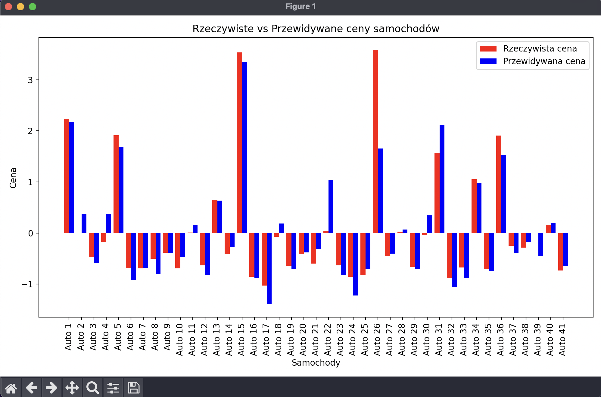
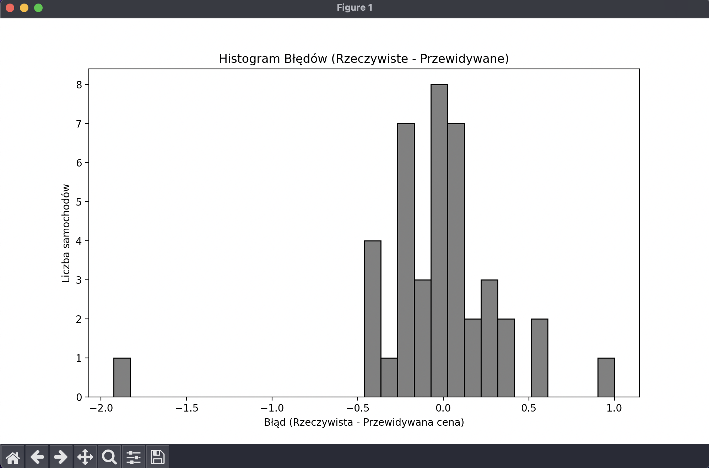

# Predykcja cen samochodów

## Opis problemu

Problem polega na przewidywaniu ceny samochodów na podstawie ich cech, takich jak moc silnika, marka czy typ paliwa. Jest to istotne w branży motoryzacyjnej i ubezpieczeniowej, gdzie dokładna wycena pojazdów jest kluczowa. Model może być używany przez dealerów samochodowych, firmy ubezpieczeniowe oraz aplikacje do porównywania cen, ułatwiając automatyczne oszacowanie wartości samochodów. Jest to interesujący problem, ponieważ dokładne przewidywanie cen wspiera podejmowanie decyzji zakupowych oraz rozwój narzędzi do analizy rynku samochodowego.

## Dane

Dane pochodzą z bazy UCI Machine Learning Repository, z zestawu "Automobile", który zawiera informacje o cechach samochodów oraz ich cenach. Dane są wiarygodne, ponieważ pochodzą z uznawanego źródła. Te dane jednak zawierały brakujące wartości, które zostały uzupełnione za pomocą imputacji. Zawierają one cechy liczbowe (np. moc silnika) oraz kategoryczne (np. marka), które mają istotny wpływ na wartość samochodu. Te dane umożliwiają modelowanie zależności między cechami a ceną, co jest kluczowe dla rozwiązywania problemu wyceny samochodów.

## Sposób rozwiązania problemu

Do rozwiązania problemu przewidywania ceny samochodów zastosowano model sieci neuronowej typu feed-forward. Sieć ta składa się z trzech warstw: wejściowej (dla cech wejściowych), dwóch warstw ukrytych z funkcją aktywacji ReLU oraz jednej warstwy wyjściowej, która przewiduje cenę samochodu. Wybór tego modelu wynika z jego zdolności do modelowania skomplikowanych, nieliniowych zależności między cechami wejściowymi a ceną, co jest istotne w przypadku tak złożonego problemu regresji.

### Etapy realizacji projektu:

- **Przygotowanie danych:** W tym etapie dokonano imputacji brakujących wartości, normalizacji cech liczbowych oraz kodowania cech kategorycznych.
- **Podział danych:** Dane zostały podzielone na zbiór treningowy (80%) i testowy (20%).
- **Budowa modelu:** Stworzono model sieci neuronowej z odpowiednią liczbą warstw oraz jednostek, z funkcją aktywacji ReLU i funkcją kosztu MSE (Mean Squared Error).
- **Trenowanie modelu:** Model został wytrenowany na zbiorze treningowym przez 50 epok, z walidacją na podzbiorze danych.
- **Ewaluacja modelu:** Po wytrenowaniu modelu przeprowadzono ewaluację na zbiorze testowym, obliczając miary błędu (MAE, MSE, RMSE, R²).

### Wyniki oceny modelu obejmują:

- **MAE** (Mean Absolute Error):

  Średnia różnica między rzeczywistymi a przewidywanymi cenami.

- **MSE** (Mean Squared Error):

  Średni kwadrat różnicy między rzeczywistymi a przewidywanymi cenami.

- **RMSE** (Root Mean Squared Error):

  Pierwiastek z MSE, który jest bardziej interpretable, ponieważ jest w tej samej jednostce co cena.

- **R²** (R-squared):

  Wskaźnik, który pokazuje, jaka część zmienności danych jest wyjaśniana przez model. Wyższa wartość R² oznacza lepsze dopasowanie modelu do danych.

- **Loss**:

  Miara straty modelu, która wskazuje średnią różnicę między przewidywanymi a rzeczywistymi wartościami. Mniejsza wartość loss oznacza lepsze dopasowanie modelu do danych, a wyższa wskazuje na większe błędy w przewidywaniach. Loss jest kluczowym wskaźnikiem w optymalizacji modelu, ponieważ bezpośrednio pokazuje, jak dobrze model radzi sobie z prognozowaniem wartości w zbiorze testowym.

Wszystkie te miary pomagają ocenić, jak dokładnie model przewiduje ceny samochodów oraz jak dobrze odwzorowuje rzeczywiste zależności w danych.

## Dyskusja wyników i ewaluacja modelu

**Wyniki modelowania:**

Po przeprowadzeniu 10 testów na modelu regresyjnym, uzyskano następujące średnie wyniki:

- **Mean Absolute Error (MAE)**: 0.2353 / **dla regresji kwantylowej**: 0.279682

  Średni błąd bezwzględny wskazuje, że model średnio popełnia błąd około 0.2353 jednostki ceny na samochód. To wskazuje na dobrą jakość modelu, ponieważ błąd nie jest zbyt duży.

- **Mean Squared Error (MSE)**: 0.1234 / **dla regresji kwantylowej**: 0.186301

  Średni błąd kwadratowy jest również stosunkowo niski, co potwierdza, że model dobrze odwzorowuje zależności w danych.

- **Root Mean Squared Error (RMSE)**: 0.3506 / **dla regresji kwantylowej**: 0.431626

  Pierwiastek średniego błędu kwadratowego daje wynik 0.3506, co jest zbliżone do przeciętnej wielkości błędów w prognozowanych wartościach.

- **R-squared (R²)**: 0.9025 / **dla regresji kwantylowej**: 0.852780

  Wartość R² wskazuje na to, że model wyjaśnia około 90.25% zmienności danych, co oznacza, że model jest bardzo efektywny w przewidywaniu ceny samochodów.

- **Accuracy**: 0.9025 / **dla regresji kwantylowej**: 0.852780

  Ponieważ model jest regresyjny, uznaliśmy R² za odpowiednik dokładności w kontekście tego zadania. Wartość ta również wynosi 90.25%, co potwierdza, że model jest skuteczny.

- **Loss**: 0.1354 / **dla regresji kwantylowej**: 0.186301

  Loss wskazuje średnią różnicę między przewidywanymi a rzeczywistymi wartościami, a wynik 0.1354 sugeruje, że model jest w stanie przewidywać ceny z niewielkim błędem, co jest dobrym wynikiem w kontekście tego zadania regresyjnego.

**Ewaluacja modelu:**  
Na podstawie uzyskanych wyników można stwierdzić, że model regresyjny dobrze się sprawdza w przewidywaniu ceny samochodów. Wysokie wartości R² oraz dokładności wskazują na skuteczność modelu. Błąd średni, zarówno MAE, jak i RMSE, jest na poziomie akceptowalnym dla tego typu zadania. Model dostarcza solidnych wyników, co czyni go przydatnym narzędziem do przewidywania cen w kontekście sprzedaży samochodów.

## Podsumowanie

**Cel projektu i realizacja celu:**  
Celem projektu było stworzenie modelu regresyjnego, który będzie w stanie przewidywać ceny samochodów na podstawie różnych cech technicznych i produkcyjnych pojazdów. Model ten, zbudowany przy użyciu sieci neuronowej, udało się zrealizować w sposób skuteczny, osiągając wysoką dokładność oraz niski poziom błędów (MAE, RMSE). R² na poziomie 90% potwierdza, że model jest w stanie w dużym stopniu odwzorować zmienność cen samochodów, co stanowi istotny sukces w kontekście tego zadania.

**Kto może skorzystać z rozwiązania i jak:**  
To rozwiązanie może być szczególnie przydatne dla firm zajmujących się handlem samochodami, dealerów, analityków rynku motoryzacyjnego, a także osób planujących zakup używanego pojazdu. Dzięki predykcji cen, mogą oni lepiej prognozować wartości rynkowe samochodów na podstawie ich cech, co ułatwia podejmowanie decyzji o zakupie, sprzedaży lub wycenie pojazdów. Możliwość szybkiego i automatycznego przewidywania cen może również pomóc w optymalizacji procesów sprzedaży, negocjacji cenowych oraz ocenie wartości pojazdów.

**Ograniczenia modelu:**  
Chociaż model osiąga wysoką skuteczność, ma także swoje ograniczenia. Przede wszystkim jest zależny od jakości danych, a ewentualne braki lub nieścisłości w danych wejściowych mogą wpłynąć na dokładność prognoz. Ponadto, model może nie radzić sobie dobrze z rzadkimi przypadkami lub wyjątkowymi samochodami, których cechy odbiegają od ogólnych trendów w danych. Ponadto, model jest oparty na cechach technicznych i produkcyjnych, a zatem nie uwzględnia czynników zewnętrznych, takich jak sytuacja gospodarcza, zmiany trendów na rynku motoryzacyjnym czy wpływ popytu i podaży na ceny samochodów.
